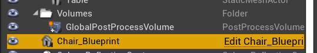

# ASSIMP-UE-demo-tutorial
ASSIMP plugin tesztelése Unreal Engine-hez

## Clone the project
- In git bash:
    ```
    git clone --recurse-submodules https://github.com/Pikike/ASSIMP-UE-demo-tutorial
    ```

### Import assets:
- This algorithm works on triangle meshes only
- Couldn't import .max
- Import files from dt_assets data table.

### Data table dt_assets columns: 
- filename: String. Filename with the path to the file.
- scale: float. Scale X, Y, Z, with this float.
- flip uvs: boolean. Set true if Post Process Flip UVs flag should be added. 


### Blueprint:
- Only the scync branch is corrected.
- Open Chair_Blueprint to open the blueprint.

    

### Forrás:
- [GitHub](https://github.com/irajsb/UE4_Assimp/wiki/How-To-Build)
- [CMake](https://cmake.org/download/): add the path to Environment variable, if needed. 


  


    
